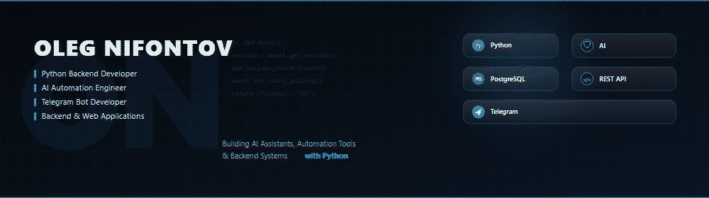
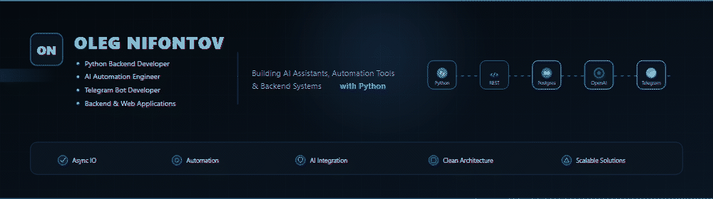
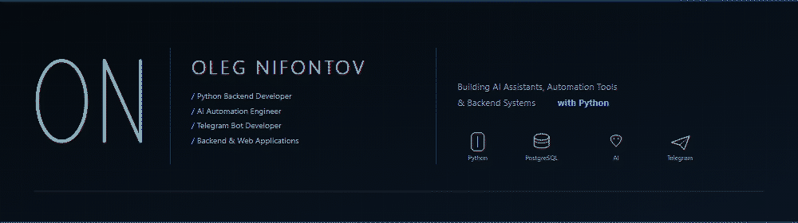

  

 

  

 

  
  

---

## About Me

I'm a **Python Backend Developer** focused on building AI-powered applications, backend systems, Telegram bots and business automation.

My main interests include AI assistants, REST API development, automation, PostgreSQL databases and scalable backend solutions.

I enjoy transforming ideas into production-ready software using clean architecture, asynchronous programming and modern Python technologies.

| | |
| :--- | :--- |
| **Name** | Oleg Nifontov |
| **Role** | Python Backend Developer · AI Automation Engineer · Telegram Bot Developer |
| **Focus** | Backend systems, AI assistants, automation tools, web applications |
| **Location** | Krasnokamsk, Perm Krai, Russia |
| **Open to** | Remote · Hybrid · Relocation |
| **Languages** | Russian (Native) · English (Intermediate / Technical Reading) |

---

## Current Focus

- Designing **AI assistants** and automation workflows with OpenAI / GigaChat APIs
- Building **Telegram bots** on aiogram 3 with PostgreSQL-backed persistence
- Strengthening **FastAPI** skills for production REST APIs
- Applying **async Python**, clean architecture and reliable error handling
- Learning **Docker** for reproducible backend environments

---

## Tech Stack

### Languages

  

### Backend & Data

  

### Tools

 

| Area | Technologies |
| :--- | :--- |
| **Languages** | Python, SQL, HTML, CSS, Bash |
| **Backend** | FastAPI (learning), aiogram 3, SQLAlchemy, Asyncio, psycopg2, Jinja2 |
| **Databases** | PostgreSQL, SQLite |
| **AI** | OpenAI API, GigaChat API |
| **APIs** | REST API, Telegram Bot API, VK API, Google Sheets API, OpenWeather API |
| **Tools** | Git, GitHub, Linux, Docker (learning), VS Code, PyCharm |
| **Other** | JSON, CSV, PDF generation, CLI apps, logging, error handling, retry logic, caching |

 

  

---

## Featured Projects

| Project | Description | Stack | Status |
| :--- | :--- | :--- | :---: |
| [telegram-ai-career-assistant](https://github.com/nifontovoleg/telegram-ai-career-assistant) | AI-powered Telegram assistant for job search, resume generation and interview preparation | Python · aiogram · PostgreSQL · SQLAlchemy · OpenAI API | Active |
| [strizhka-ai-bot](https://github.com/nifontovoleg/strizhka-ai-bot) | AI concierge for beauty salons with booking automation and intelligent client communication | Python · Telegram Bot API · OpenAI API | Active |
| [dual-llm-text-agent](https://github.com/nifontovoleg/dual-llm-text-agent) | Application combining multiple LLMs for intelligent text processing | Python · OpenAI API | Active |
| [telegram-summary-bot](https://github.com/nifontovoleg/telegram-summary-bot) | Telegram bot that summarizes conversations and documents using AI | Python · Telegram Bot API · OpenAI API | Active |
| [AIWellnessAssistantforPets_bot](https://github.com/nifontovoleg/AIWellnessAssistantforPets_bot) | AI assistant for pet owners with wellness recommendations | Python · OpenAI API | Active |
| [pdf-generator-from-data](https://github.com/nifontovoleg/pdf-generator-from-data) | Generate professional PDF documents from structured data | Python · ReportLab | Active |
| [currency-travel-bot](https://github.com/nifontovoleg/currency-travel-bot) | Currency conversion assistant for travelers | Python · REST API | Completed |
| [vk-weather-bot](https://github.com/nifontovoleg/vk-weather-bot) | Weather bot for VK using OpenWeather API | Python · VKBottle · OpenWeather API | Completed |

<b>Pinned repository cards</b>

 

  
  

  
  

---

## GitHub Analytics

  
  

 

  

 

  

---

## Achievements

- Built and shipped multiple **production-oriented AI Telegram bots**
- Integrated **OpenAI / GigaChat** into practical automation products
- Worked with **PostgreSQL + SQLAlchemy** for persistent bot backends
- Delivered utilities for **PDF generation**, currency conversion and weather APIs
- Continuously expanding toward **FastAPI** services and containerized deployments

---

## Roadmap

| Track | Next steps |
| :--- | :--- |
| **Backend** | Deepen FastAPI, authentication, service layering, testing |
| **Data** | Stronger PostgreSQL modeling, migrations, query performance |
| **AI** | Multi-agent flows, tool calling, reliable prompt pipelines |
| **Ops** | Dockerize services, basic CI, structured logging & monitoring |
| **Product** | Expand portfolio demos and polished README-driven releases |

---

## Education

**Python Developer** — self-study through practical projects, AI automation and backend development.

---

## Contact

| Channel | Details |
| :--- | :--- |
| **Email** | [o.nifontov@yandex.ru](mailto:o.nifontov@yandex.ru) |
| **GitHub** | [github.com/nifontovoleg](https://github.com/nifontovoleg) |
| **Website** | [nifontovv.ru](https://www.nifontovv.ru/) |
| **Telegram** | [@olegugfv_reg59](https://t.me/olegugfv_reg59) |
| **LinkedIn** | Coming soon |

---

  
    
  
    
  © 2026 Oleg Nifontov · Built with Python mindset
   
  <a href="#top">Back to top</a>

