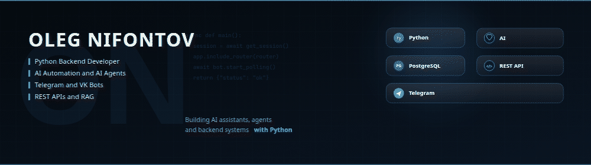
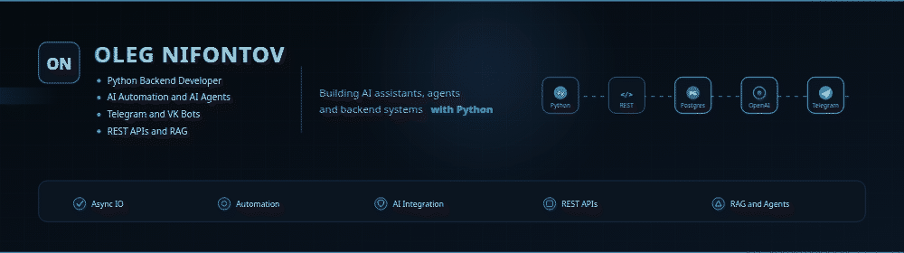
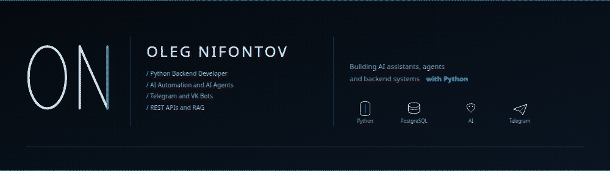

  

 

  

 

  
  

  

# OLEG NIFONTOV

## Python Backend Developer
### AI Automation and AI Agents

I build practical AI-powered backend systems, AI assistants, agents and automation solutions with Python.

Python is the foundation. Backend is the core engineering skill. AI is the specialization. Automation is how these systems create value. Telegram and VK are delivery channels for applied products.

| | |
| :--- | :--- |
| **Name** | Oleg Nifontov |
| **Role** | Python Backend Developer |
| **Specialization** | AI Automation and AI Agents |
| **Location** | Russia |
| **Open to** | Remote · Hybrid · Relocation |
| **Languages** | Russian (Native) · English (Intermediate / Technical Reading) |

  

## What I Build

- Python backend systems
- REST APIs
- AI assistants
- AI agents
- RAG systems
- LLM integrations
- Telegram and VK bots
- Business automation
- API integrations

  

## Tech Stack

 

| Area | Technologies |
| :--- | :--- |
| **Languages** | Python, SQL, Bash |
| **Backend** | FastAPI, Flask, aiogram 3, SQLAlchemy, Pydantic, asyncio |
| **Databases** | SQLite, PostgreSQL |
| **AI** | OpenAI API, LangChain, LangGraph, Pinecone, GigaChat API |
| **APIs & integrations** | REST APIs, Telegram Bot API, VK API (vkbottle), Google Sheets / Drive / Calendar |
| **Tools** | Git, GitHub, Linux, VS Code, PyCharm |

  

  

## Featured Projects

### [EXELIOV2-CRM-GDRIVE](https://github.com/nifontovoleg/EXELIOV2-CRM-GDRIVE)

Desktop mini-CRM with a FastAPI REST backend, SQLite storage and a Tkinter UI. Covers clients, deals, orders and tasks, with export to Google Sheets / Drive and styled KPI spreadsheets.

**Stack:** Python · FastAPI · Pydantic · SQLite · Google Sheets API · Google Drive API

### [pinecone-rag-telegram-bot](https://github.com/nifontovoleg/pinecone-rag-telegram-bot)

RAG Telegram bot with Pinecone vector search, URL ingestion into embeddings, LangChain agent tools, per-user memory and an external REST tool.

**Stack:** Python · LangChain · Pinecone · OpenAI-compatible API · Telegram Bot API

### [shopmcp](https://github.com/nifontovoleg/shopmcp)

Telegram shop agent split into an aiogram 3 bot and a FastMCP server. Catalog, cart and checkout live in SQLite; the model routes tool calls over MCP, with extra tools for weather, crypto and other public APIs.

**Stack:** Python · aiogram 3 · FastMCP · SQLite · OpenAI-compatible API

### [strizhka-ai-bot](https://github.com/nifontovoleg/strizhka-ai-bot)

Telegram AI assistant for a barbershop: dialogue over a service knowledge base, appointment booking with slot checks, admin notifications and optional Google Calendar sync. Function calling drives booking actions.

**Stack:** Python · python-telegram-bot · GigaChat · SQLite · Google Calendar API (optional)

[Screenshot](https://github.com/nifontovoleg/strizhka-ai-bot/blob/main/screenshot.png)

### [langchain-content-pipeline](https://github.com/nifontovoleg/langchain-content-pipeline)

CLI content pipeline: a short brief goes through a 4-step LangChain chain (analysis → tools → generate → review) and is saved as a Telegram post or article draft.

**Stack:** Python · LangChain · Pydantic v2 · OpenAI-compatible API

<b>Pinned repository cards</b>

 

  
  

  
  

  

## Additional Projects

| Project | Focus |
| :--- | :--- |
| [flask-go-users-api](https://github.com/nifontovoleg/flask-go-users-api) | Users REST API in Flask (and a parallel Go service), SQLite, OpenAPI 3.1 |
| [langchain-telegram-tool-agent](https://github.com/nifontovoleg/langchain-telegram-tool-agent) | LangChain tool-calling agent: search, weather, FX/crypto, files, HTTP, QR |
| [dori-nemo-memory-bots](https://github.com/nifontovoleg/dori-nemo-memory-bots) | Two aiogram 3 bots comparing in-memory context vs PostgreSQL facts (SQLAlchemy 2) |
| [VKONTAKTE_BOT](https://github.com/nifontovoleg/VKONTAKTE_BOT) | VK assistant: GPT chat, consultation booking, quiz and FAQ on vkbottle |
| [telegram-summary-bot](https://github.com/nifontovoleg/telegram-summary-bot) | Collects Telegram messages into SQLite and builds GigaChat summaries; Flask viewer |
| [haystack-telegram-agent-v2](https://github.com/nifontovoleg/haystack-telegram-agent-v2) | Haystack agent with Pinecone memory, document RAG and OpenAI tools |
| [langchain-breed-agent](https://github.com/nifontovoleg/langchain-breed-agent) | LangChain / LangGraph agent with structured output and conversation memory |
| [vk-weather-bot](https://github.com/nifontovoleg/vk-weather-bot) | VK weather bot: FSM, forecast, geolocation and air quality via OpenWeatherMap |
| [dual-llm-text-agent](https://github.com/nifontovoleg/dual-llm-text-agent) | CLI chat agent with dialogue memory: Claude thinking mode and OpenAI models |
| [pdf-generator-from-data](https://github.com/nifontovoleg/pdf-generator-from-data) | PDF generation from CSV, JSON and Google Sheets using HTML templates |

  

## AI and Automation

| Direction | Where it shows up |
| :--- | :--- |
| **AI assistants** | Knowledge-base dialogue, booking and FAQ in Telegram / VK |
| **AI agents** | Tool-calling agents (LangChain, Haystack, MCP) that call APIs and local tools |
| **RAG** | Pinecone semantic search, URL/document ingestion, hybrid group memory |
| **LLM pipelines** | Multi-step LangChain chains with Pydantic structured output |
| **Function calling** | Booking slots, catalog/cart actions, weather and other external tools |
| **API automation** | Google Sheets / Drive / Calendar, OpenWeather, public HTTP APIs |
| **Business workflows** | CRM records and reports, salon booking, shop checkout, chat summarization |

  

## Backend Development

| Area | Practice in public repos |
| :--- | :--- |
| **Python** | Async bots, CLI tools, REST services |
| **REST API** | FastAPI CRM API; Flask users API with OpenAPI 3.1 |
| **Databases** | SQLite across most apps; PostgreSQL + SQLAlchemy 2 in memory-bot backends |
| **External APIs** | OpenAI-compatible LLMs, Google APIs, Telegram, VK, weather and market APIs |

  

## GitHub Stats

  
  

 

  

 

  

  

## Contact

| Channel | Details |
| :--- | :--- |
| **Website** | [nifontovv.ru](https://nifontovv.ru/) |
| **Portfolio / applications** | [nifontov.tech](https://www.nifontov.tech/) |
| **GitHub** | [github.com/nifontovoleg](https://github.com/nifontovoleg) |
| **Email** | [o.nifontov@yandex.ru](mailto:o.nifontov@yandex.ru) |
| **Telegram** | [@olegugfv_reg59](https://t.me/olegugfv_reg59) |

  

  
    
  
    
  © 2026 Oleg Nifontov
   
  <a href="#top">Back to top</a>

